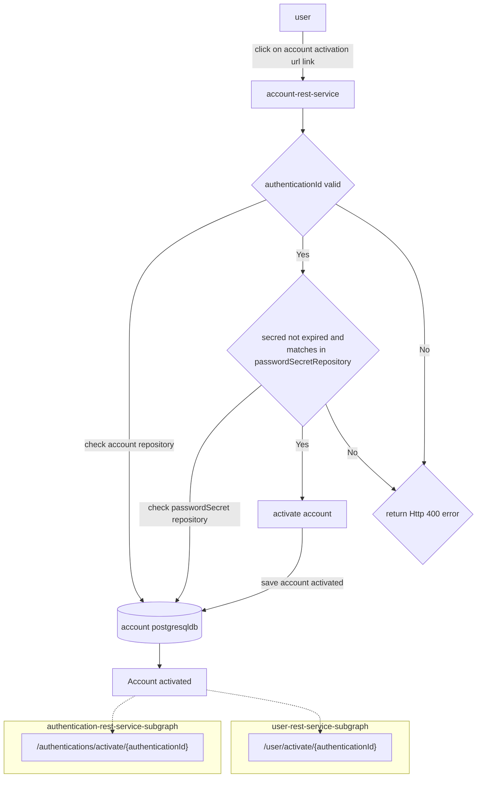

# account-rest-service

This is a Account Rest Service api built using Spring WebFlux. 
This is a reactive Java webservice api.


## Run locally

```
mvn spring-boot:run  -Dspring-boot.run.arguments="--POSTGRES_USERNAME=dummy \
                      --POSTGRES_PASSWORD=dummy \
                      --POSTGRES_DBNAME=account \
                      --POSTGRES_SERVICE=localhost:5432"
```
 
 
## Build Docker image

Build docker image using included Dockerfile.


`docker build -t imageregistry/account-rest-service:1.0 .` 

## Push Docker image to repository

`docker push imageregistry/account-rest-service:1.0`

## Deploy Docker image locally

`docker run -e POSTGRES_USERNAME=dummy \
 -e POSTGRES_PASSWORD=dummy -e POSTGRES_DBNAME=account \
  -e POSTGRES_SERVICE=localhost:5432 \
 --publish 8080:8080 imageregistry/account-rest-service:1.0`


## Installation on Kubernetes
Use a Helm chart such as my one here @ [sonam-helm-chart](https://github.com/sonamsamdupkhangsar/sonam-helm-chart):

```
helm install project-api sonam/mychart -f values.yaml --version 0.1.12 --namespace=yournamespace
```

##Instruction for port-forwarding database pod
```
export PGMASTER=$(kubectl get pods -o jsonpath={.items..metadata.name} -l application=spilo,cluster-name=project-minimal-cluster,spilo-role=master -n yournamespace); 
echo $PGMASTER;
kubectl port-forward $PGMASTER 6432:5432 -n yournamespace;
```

###Login to database instruction
```
export PGPASSWORD=$(kubectl get secret <SECRET_NAME> -o 'jsonpath={.data.password}' -n yournamesapce | base64 -d);
echo $PGPASSWORD;
export PGSSLMODE=require;
psql -U <USER> -d projectdb -h localhost -p 6432

```

Workflow


#### User Activate Account diagram



