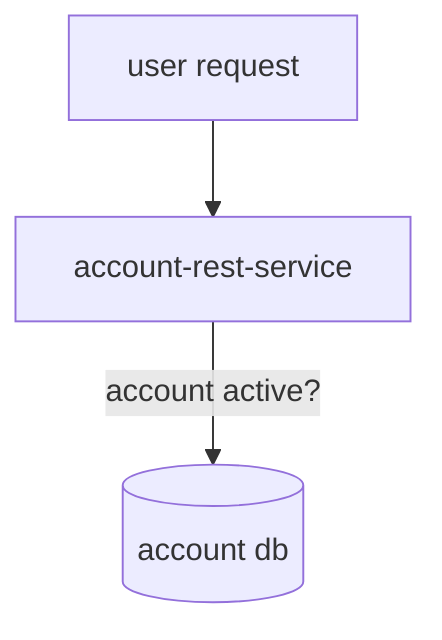
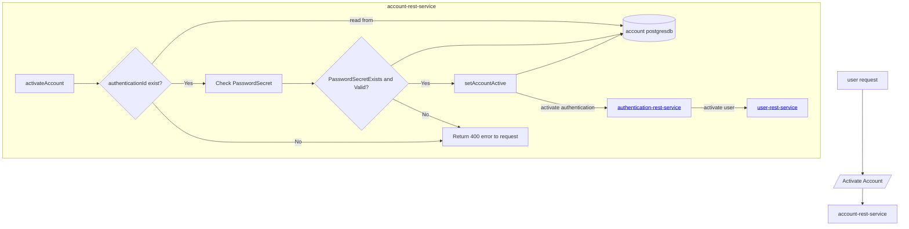
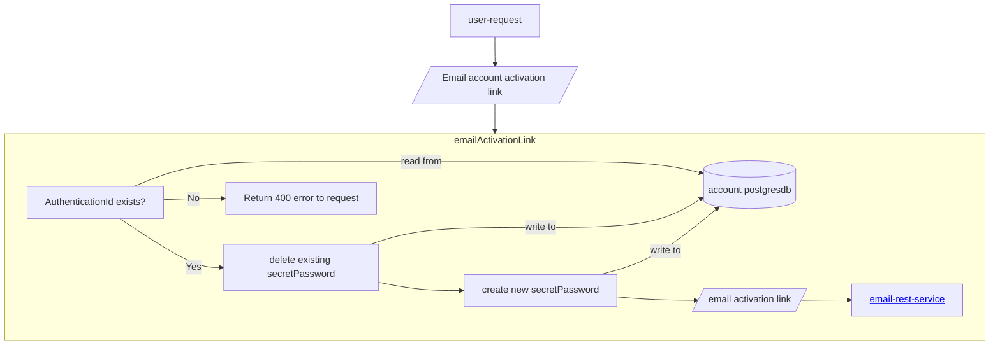
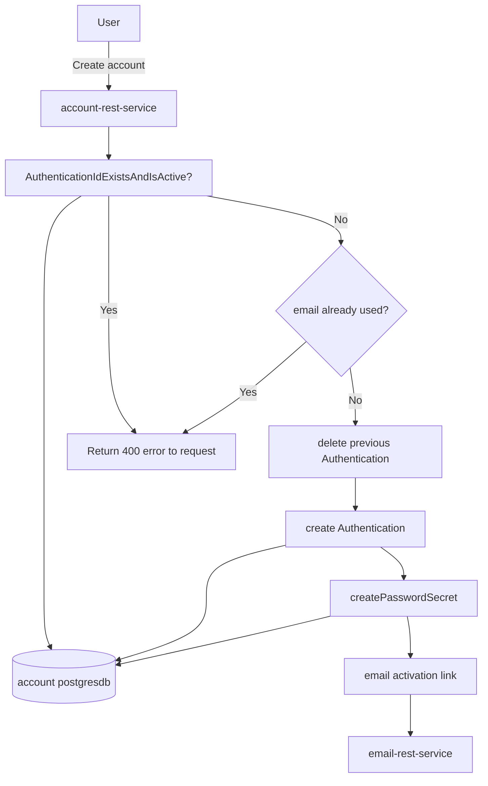
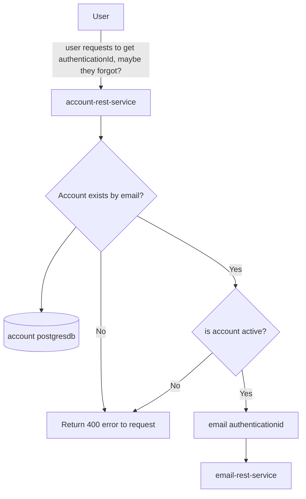
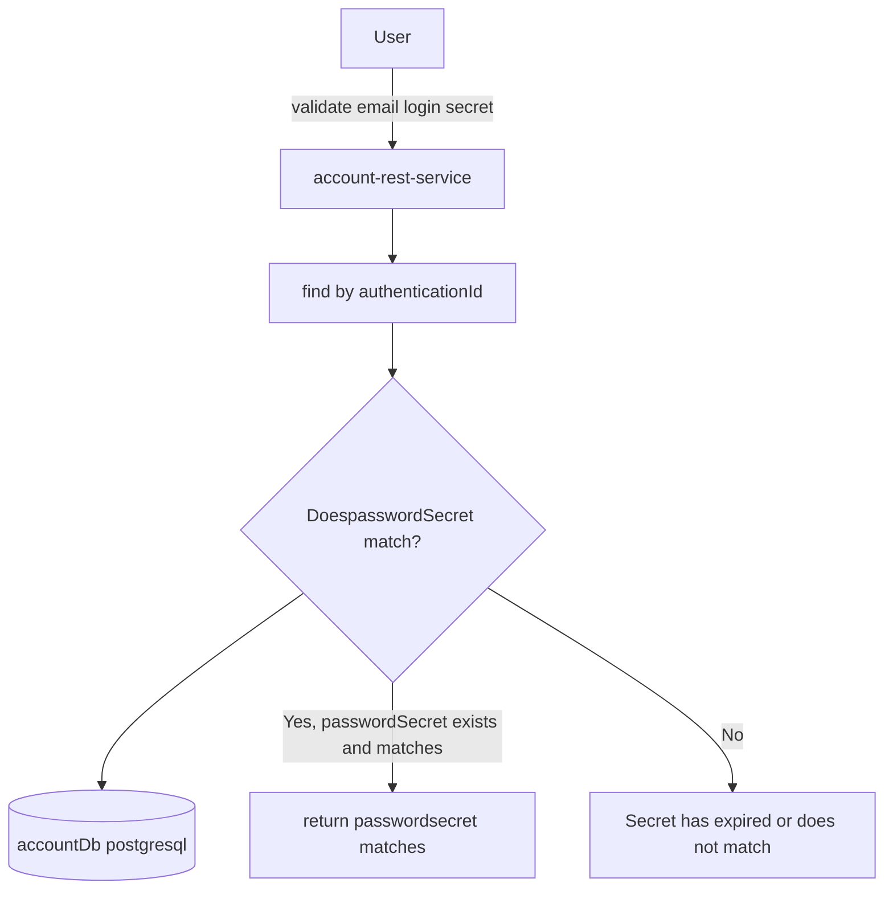
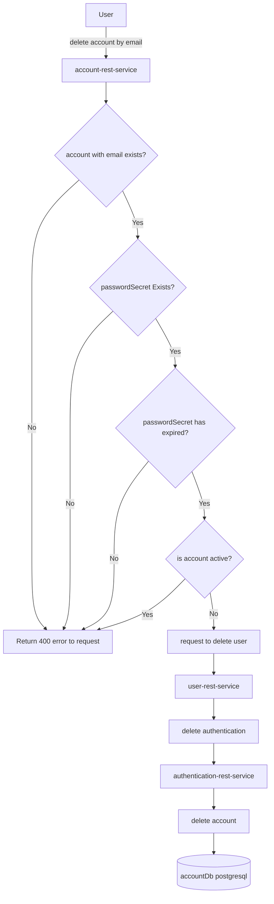

# account-rest-service

This is a Account Rest Service api built using Spring WebFlux. 
This is a reactive Java webservice api.


## Run locally using profile
Use the following to run local profile which will pick up properties defined in the `application-local.yml` :


```
mvn spring-boot:run -Dspring-boot.run.arguments="--spring.profiles.active=local"
```

Or you can do something like following too:

```
mvn spring-boot:run -Dspring-boot.run.arguments="--server.port=8086 --jwt.issuer=sonam.us \
    --POSTGRES_USERNAME=test \
    --POSTGRES_PASSWORD=test \
    --POSTGRES_DBNAME=account2 \
    --POSTGRES_SERVICE=localhost:5432
    --DB_SSLMODE=disable
    --eureka.client.enabled=false"                      
```


## Build Docker image

Build docker image using included Dockerfile.


`docker build -t imageregistry/account-rest-service:1.0 .` 

## Push Docker image to repository

`docker push imageregistry/account-rest-service:1.0`

## Deploy Docker image locally

`docker run -e POSTGRES_USERNAME=dummy \
 -e POSTGRES_PASSWORD=dummy -e POSTGRES_DBNAME=account \
  -e POSTGRES_SERVICE=localhost:5432 \
 --publish 8080:8080 imageregistry/account-rest-service:1.0`


## Installation on Kubernetes
Use a Helm chart such as my one here @ [sonam-helm-chart](https://github.com/sonamsamdupkhangsar/sonam-helm-chart):

```
helm install project-api sonam/mychart -f values.yaml --version 0.1.12 --namespace=yournamespace
```

## Instruction for port-forwarding database pod
```
export PGMASTER=$(kubectl get pods -o jsonpath={.items..metadata.name} -l application=spilo,cluster-name=project-minimal-cluster,spilo-role=master -n yournamespace); 
echo $PGMASTER;
kubectl port-forward $PGMASTER 6432:5432 -n yournamespace;
```

### Login to database instruction
```
export PGPASSWORD=$(kubectl get secret <SECRET_NAME> -o 'jsonpath={.data.password}' -n yournamesapce | base64 -d);
echo $PGPASSWORD;
export PGSSLMODE=require;
psql -U <USER> -d projectdb -h localhost -p 6432
```

## User Account Workflow
endpoints: 
1. Create account
2. Activate account
3. Email activation link
4. Password reset 
5. Account active check
6. Get authenticationId
7. Validate Emailed Login Secret
8. Delete account associated with email


## Account active check workflow


## ActivateAccount

  
## Email activation link


## Email User secret
```mermaid
flowchart TD
  User[user-request] -->EmailSecret[/Email Secret for Password reset/]--> account-rest-service
  
  subgraph account-rest-service[emailMySecret] 
  validateAuthenticationIdExistsAndTrue["AuthenticationIdExistsAndIsActive?"]
  validateAuthenticationIdExistsAndTrue --> accountDb[(account postgresdb)]
  validateAuthenticationIdExistsAndTrue -->|Yes| deleteAnySecretPassword["delete existing secretPassword"]
  deleteAnySecretPassword --> accountDb
  validateAuthenticationIdExistsAndTrue -->|No| ReturnError[Return 400 error to request]
  deleteAnySecretPassword --> createNewSecretPassword["create new secretPassword"]
  createNewSecretPassword --> accountDb
  createNewSecretPassword --> emailSecret["email secret"]
  emailSecret --> email-rest-service   
  end               
```


## Create account



## Send authenticationId by email


## Validate email login secret


## Delete account by email


If Account is not getting activated, try resend email activation link
